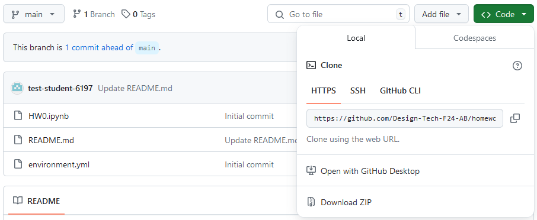

Welcome to homework 1. Again, you will need to clone this repo to your local machine. I have copied the instructions here for ease of access.

>[!NOTE]
>There are now two environment files in this repository. When you create the environment with mamba for this assignment you need to ensure that you install the correct version for your computer. There is one environment_mac.yml file and another environment_win.yml for windows computers. There will be instructions below for you to follow to set up your environment correctly.

### Step 1: Clone the repository

Once you are in the repository, you should see a green button that says "Code". Click on that button and you should see a URL. Copy that URL using the copy button.

It should look like this:

Now go and open github desktop. Go to file -> clone repository. Make sure you are on the 'URL' tab and paste the URL you copied into the 'Repository URL' box. Choose a location on your computer where you want to save the repository and click 'Clone'. Generally you can just leave the path as it is, unless you have some specific reason to change it. 

Now you should see the repository in your github desktop. If you get a popup, you can just accept whichever option makes the most sense for you.

Finally you can click the button that says 'Open in Visual Studio Code' to open the repository in your code editor.

The process should look like this:

### Step 2: Set up your environment

In VS Code, open the terminal by going to Terminal -> New Terminal. You should see a terminal open at the bottom of your screen. This step is the one that is different from HW0 and will depend on which operating system you use.

In the terminal on windows, type the following command:

`mamba env create -f environment_win.yml -y`

In the terminal on mac, type the following command:

`mamba env create -f environment_mac.yml -y`

and then press enter. This will create a new environment called 'DESIGN-6197-4197-HW1' install the necessary packages. 

Once the environment is done installing, you should see some instructions on how to activate the environment. You can ignore this and just close out of the terminal window.

### Step 3: Open the notebook

In the file explorer on the left side of the screen there will be a file called HW1.ipynb. Click on this file to open it. You should see the notebook open in a new tab. 

At the top right-hand side of the tab you should see a button that says 'Select Kernel'. A kernel is basically the environment that the notebook runs in. You should see another menu pop up. It may say 'Select a Kernel Source', you should select the python one. Then select the environment that is called 'DESIGN-6197-4197-HW1'. If you are on a Mac, you may need to restart vs code before this environment will appear after running the `mamba env create` command.

>[!NOTE]
>The name of the environment is slightly different from the one for HW0. You can delete the environment for HW0 if you want, but it is not required. This should be entirely separate from that one.

Now you should be all set up and ready to go! You can begin following the instructions in the notebook to complete the rest of the assignment.

